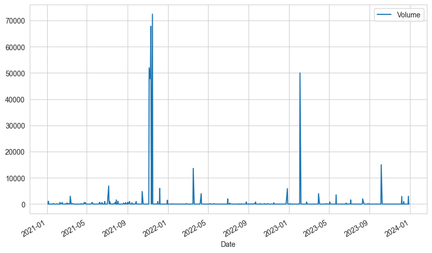
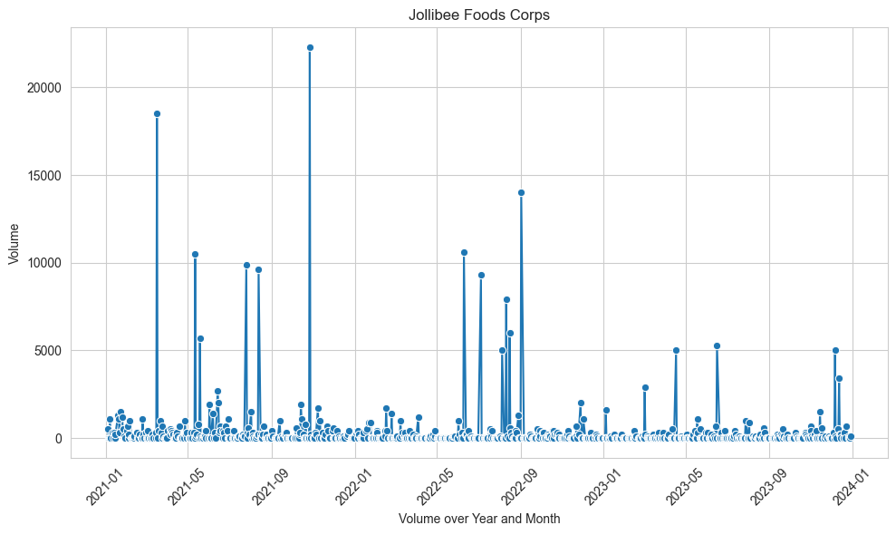
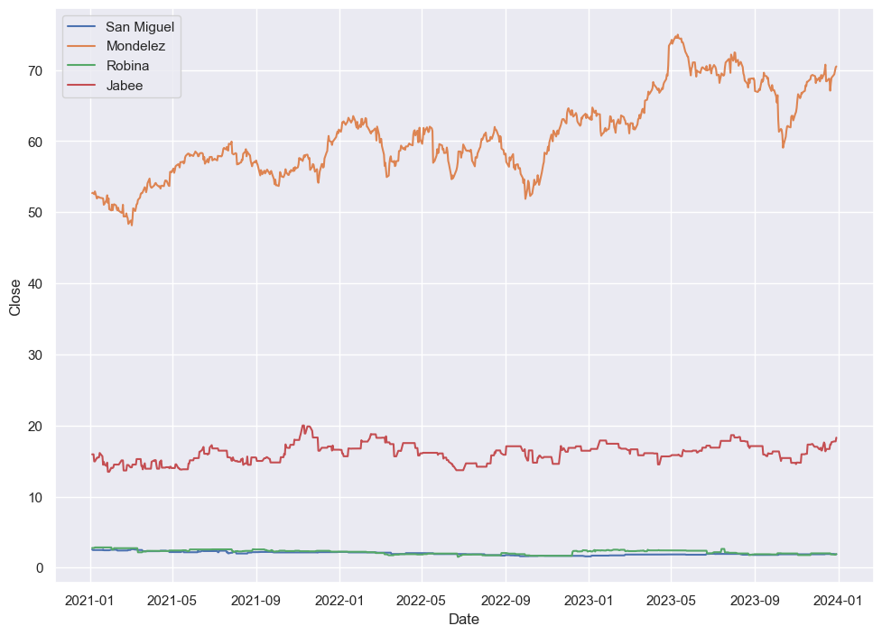
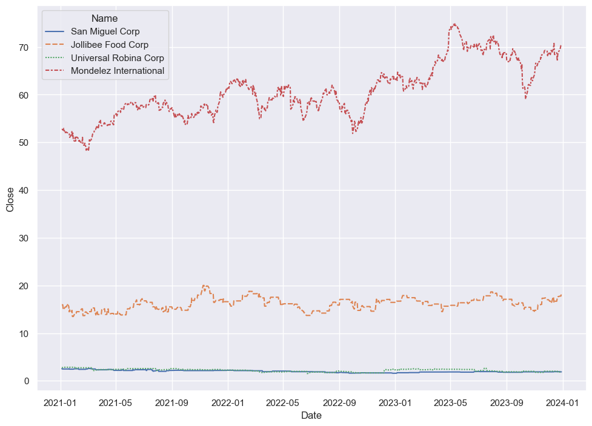
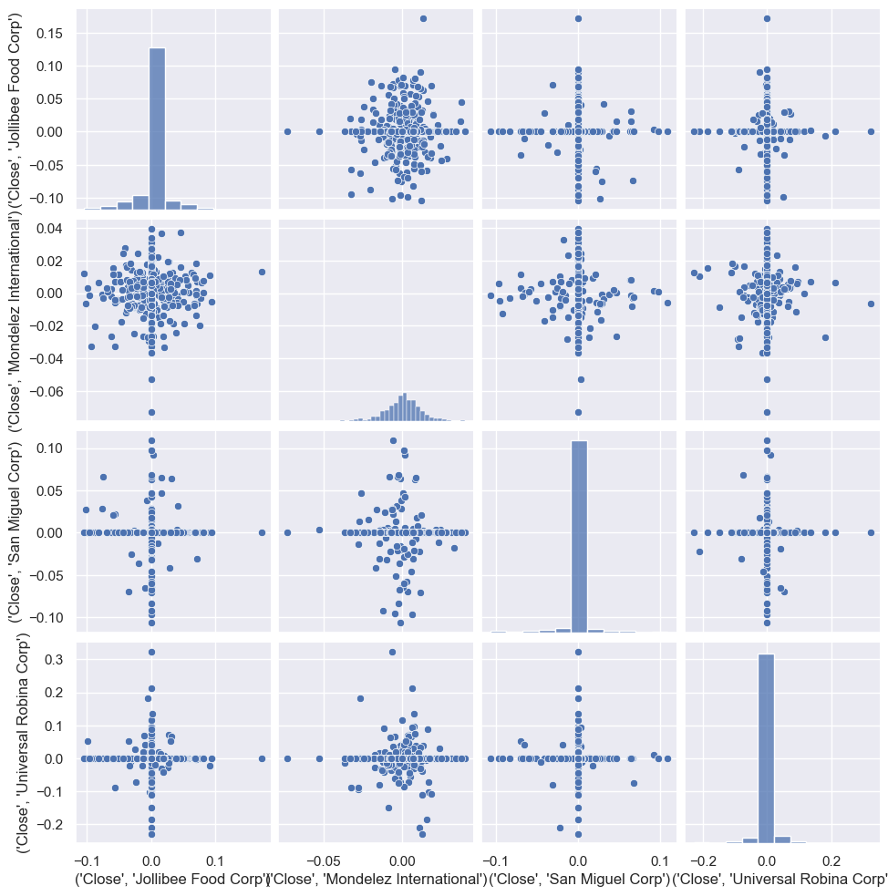
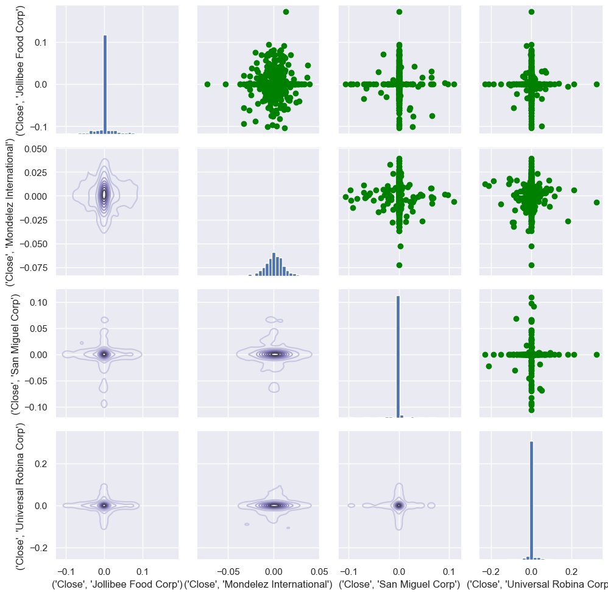
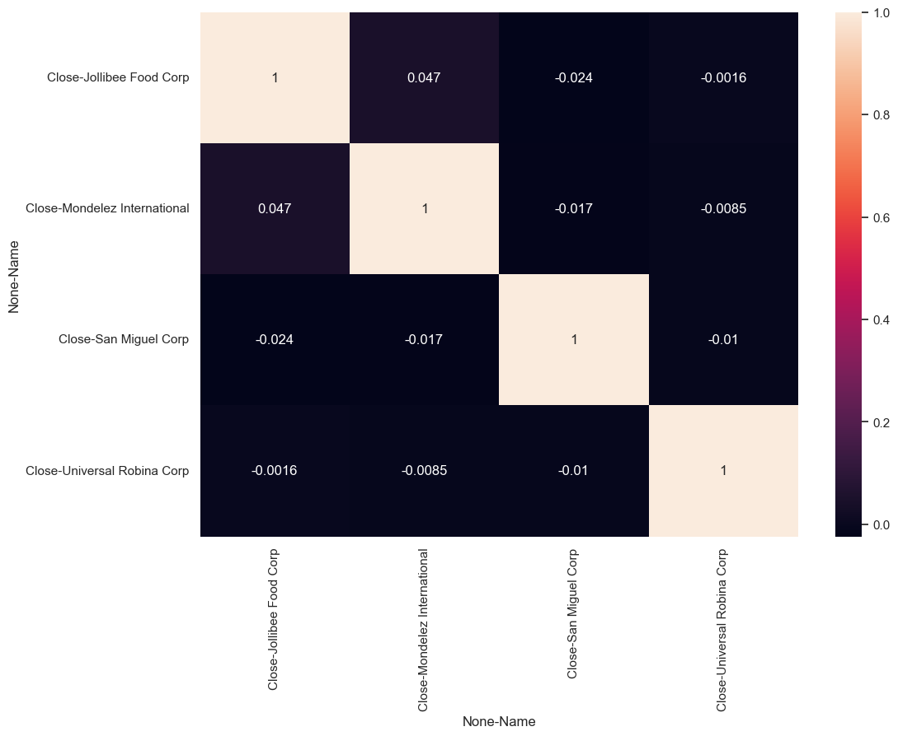

Before Getting Started make sure you got pip and python 3.8 or higher

I am using a Jupyter Notebook and I might already have these libraries but going to run it just in case


```python
pip install pandas numpy matplotlib yfinance seaborn
```

These are the following companies we are going to use for analyzing:
San Miguel Corporation (SMGBF)
Jollibee Foods Corporation (JBFCY)
Universal Robina Corporation (UVRBF)
Mondelez International, Inc.(MDLZ)

yfinance is a library for fetching historical stock data

pandas for Data Exploration and Data Cleaning

seaborn and matplotlib for Data Visualization (Honestly when I heard about these in 2016 or 17 I thought these were YouTubers)


```python
#pandas and NumPy imports
import pandas as pd
from pandas import Series,DataFrame
import numpy as np
```


```python
# For Visualization
import matplotlib.pyplot as plt
import seaborn as sns
sns.set_style('whitegrid')
%matplotlib inline
```


```python
import os #for files read/write
from datetime import datetime # For time stamps
import yfinance as yf #fetching the data stock
from __future__ import division# For division in Python 3
```


```python
# Fetch stock data
def fetch_stock_data(ticker, start_date, end_date):
    stock_data = yf.download(ticker, start=start_date, end=end_date)
    return stock_data
smg_data = fetch_stock_data('SMGBF', '2021-01-01', '2023-12-31')
jbf_data = fetch_stock_data('JBFCY', '2021-01-01', '2023-12-31')
uvr_data = fetch_stock_data('UVRBF', '2021-01-01', '2023-12-31')
delm_data = fetch_stock_data('MDLZ', '2021-01-01', '2023-12-31')
```

    [*********************100%***********************]  1 of 1 completed
    [*********************100%***********************]  1 of 1 completed
    [*********************100%***********************]  1 of 1 completed
    [*********************100%***********************]  1 of 1 completed
    

checking data


```python
print(smg_data.head())
print(jbf_data.head())
print(uvr_data.head())
print(delm_data.head())
```

    Price          Close      High       Low      Open Volume
    Ticker         SMGBF     SMGBF     SMGBF     SMGBF  SMGBF
    Date                                                     
    2021-01-04  2.550820  2.550820  2.550820  2.550820      0
    2021-01-05  2.479167  2.479167  2.479167  2.479167   1100
    2021-01-06  2.479167  2.479167  2.479167  2.479167      0
    2021-01-07  2.479167  2.479167  2.479167  2.479167      0
    2021-01-08  2.479167  2.479167  2.479167  2.479167      0
    Price           Close       High        Low       Open Volume
    Ticker          JBFCY      JBFCY      JBFCY      JBFCY  JBFCY
    Date                                                         
    2021-01-04  15.941961  15.941961  15.941961  15.941961    500
    2021-01-05  15.941961  15.941961  15.941961  15.941961      0
    2021-01-06  15.941961  15.941961  15.941961  15.941961      0
    2021-01-07  14.946193  15.139546  14.946193  14.946193   1100
    2021-01-08  14.946193  14.946193  14.946193  14.946193      0
    Price          Close      High       Low      Open Volume
    Ticker         UVRBF     UVRBF     UVRBF     UVRBF  UVRBF
    Date                                                     
    2021-01-04  2.765748  2.765748  2.765748  2.765748      0
    2021-01-05  2.765748  2.765748  2.765748  2.765748      0
    2021-01-06  2.765748  2.765748  2.765748  2.765748      0
    2021-01-07  2.765748  2.765748  2.765748  2.765748      0
    2021-01-08  2.844769  2.844769  2.844769  2.844769   5000
    Price           Close       High        Low       Open   Volume
    Ticker           MDLZ       MDLZ       MDLZ       MDLZ     MDLZ
    Date                                                           
    2021-01-04  52.686432  54.578488  52.149747  53.204931  9187200
    2021-01-05  52.741009  52.868358  52.140646  52.659141  5421900
    2021-01-06  52.640957  53.059395  52.449933  52.750116  7663200
    2021-01-07  52.540890  53.077578  52.167937  52.504507  8589100
    2021-01-08  52.932041  53.004814  52.149752  52.186135  6642700
    

checking for dupes


```python
print(smg_data.isnull().sum())
print(jbf_data.isnull().sum())
print(uvr_data.isnull().sum())
print(delm_data.isnull().sum())
```


```python
type(smg_data) #I just like to check what type of data we are working with
```

checking excel file


```python
path = 'fnbStocks.xlsx'
isExist = os.path.exists(path)
print(isExist)
```

    True
    

So there was an error making the excel and here you would see that the columns for our data frame has two values 


```python
display(smg_data)
```


<div>
<style scoped>
    .dataframe tbody tr th:only-of-type {
        vertical-align: middle;
    }

    .dataframe tbody tr th {
        vertical-align: top;
    }

    .dataframe thead tr th {
        text-align: left;
    }

    .dataframe thead tr:last-of-type th {
        text-align: right;
    }
</style>
<table border="1" class="dataframe">
  <thead>
    <tr>
      <th>Price</th>
      <th>Close</th>
      <th>High</th>
      <th>Low</th>
      <th>Open</th>
      <th>Volume</th>
    </tr>
    <tr>
      <th>Ticker</th>
      <th>SMGBF</th>
      <th>SMGBF</th>
      <th>SMGBF</th>
      <th>SMGBF</th>
      <th>SMGBF</th>
    </tr>
    <tr>
      <th>Date</th>
      <th></th>
      <th></th>
      <th></th>
      <th></th>
      <th></th>
    </tr>
  </thead>
  <tbody>
    <tr>
      <th>2021-01-04</th>
      <td>2.550820</td>
      <td>2.550820</td>
      <td>2.550820</td>
      <td>2.550820</td>
      <td>0</td>
    </tr>
    <tr>
      <th>2021-01-05</th>
      <td>2.479167</td>
      <td>2.479167</td>
      <td>2.479167</td>
      <td>2.479167</td>
      <td>1100</td>
    </tr>
    <tr>
      <th>2021-01-06</th>
      <td>2.479167</td>
      <td>2.479167</td>
      <td>2.479167</td>
      <td>2.479167</td>
      <td>0</td>
    </tr>
    <tr>
      <th>2021-01-07</th>
      <td>2.479167</td>
      <td>2.479167</td>
      <td>2.479167</td>
      <td>2.479167</td>
      <td>0</td>
    </tr>
    <tr>
      <th>2021-01-08</th>
      <td>2.479167</td>
      <td>2.479167</td>
      <td>2.479167</td>
      <td>2.479167</td>
      <td>0</td>
    </tr>
    <tr>
      <th>...</th>
      <td>...</td>
      <td>...</td>
      <td>...</td>
      <td>...</td>
      <td>...</td>
    </tr>
    <tr>
      <th>2023-12-22</th>
      <td>1.920405</td>
      <td>1.920405</td>
      <td>1.920405</td>
      <td>1.920405</td>
      <td>0</td>
    </tr>
    <tr>
      <th>2023-12-26</th>
      <td>1.920405</td>
      <td>1.920405</td>
      <td>1.920405</td>
      <td>1.920405</td>
      <td>0</td>
    </tr>
    <tr>
      <th>2023-12-27</th>
      <td>1.880809</td>
      <td>1.969900</td>
      <td>1.880809</td>
      <td>1.969900</td>
      <td>3000</td>
    </tr>
    <tr>
      <th>2023-12-28</th>
      <td>1.880809</td>
      <td>1.880809</td>
      <td>1.880809</td>
      <td>1.880809</td>
      <td>0</td>
    </tr>
    <tr>
      <th>2023-12-29</th>
      <td>1.880809</td>
      <td>1.880809</td>
      <td>1.880809</td>
      <td>1.880809</td>
      <td>0</td>
    </tr>
  </tbody>
</table>
<p>753 rows × 5 columns</p>
</div>


```python
display(smg_data.columns)
```


    MultiIndex([( 'Close', 'SMGBF'),
                (  'High', 'SMGBF'),
                (   'Low', 'SMGBF'),
                (  'Open', 'SMGBF'),
                ('Volume', 'SMGBF')],
               names=['Price', 'Ticker'])


reassigned every dataframe with a new column


```python
smg_data.columns= [col[0] for col in smg_data.columns]
jbf_data.columns=[col[0] for col in jbf_data.columns]
uvr_data.columns=[col[0] for col in uvr_data.columns]
delm_data.columns=[col[0] for col in delm_data.columns]
```


```python
display(smg_data.columns)
```


    Index(['Close', 'High', 'Low', 'Open', 'Volume'], dtype='object')


```python
display(smg_data)
```


<div>
<style scoped>
    .dataframe tbody tr th:only-of-type {
        vertical-align: middle;
    }

    .dataframe tbody tr th {
        vertical-align: top;
    }

    .dataframe thead th {
        text-align: right;
    }
</style>
<table border="1" class="dataframe">
  <thead>
    <tr style="text-align: right;">
      <th></th>
      <th>Close</th>
      <th>High</th>
      <th>Low</th>
      <th>Open</th>
      <th>Volume</th>
    </tr>
    <tr>
      <th>Date</th>
      <th></th>
      <th></th>
      <th></th>
      <th></th>
      <th></th>
    </tr>
  </thead>
  <tbody>
    <tr>
      <th>2021-01-04</th>
      <td>2.550820</td>
      <td>2.550820</td>
      <td>2.550820</td>
      <td>2.550820</td>
      <td>0</td>
    </tr>
    <tr>
      <th>2021-01-05</th>
      <td>2.479167</td>
      <td>2.479167</td>
      <td>2.479167</td>
      <td>2.479167</td>
      <td>1100</td>
    </tr>
    <tr>
      <th>2021-01-06</th>
      <td>2.479167</td>
      <td>2.479167</td>
      <td>2.479167</td>
      <td>2.479167</td>
      <td>0</td>
    </tr>
    <tr>
      <th>2021-01-07</th>
      <td>2.479167</td>
      <td>2.479167</td>
      <td>2.479167</td>
      <td>2.479167</td>
      <td>0</td>
    </tr>
    <tr>
      <th>2021-01-08</th>
      <td>2.479167</td>
      <td>2.479167</td>
      <td>2.479167</td>
      <td>2.479167</td>
      <td>0</td>
    </tr>
    <tr>
      <th>...</th>
      <td>...</td>
      <td>...</td>
      <td>...</td>
      <td>...</td>
      <td>...</td>
    </tr>
    <tr>
      <th>2023-12-22</th>
      <td>1.920405</td>
      <td>1.920405</td>
      <td>1.920405</td>
      <td>1.920405</td>
      <td>0</td>
    </tr>
    <tr>
      <th>2023-12-26</th>
      <td>1.920405</td>
      <td>1.920405</td>
      <td>1.920405</td>
      <td>1.920405</td>
      <td>0</td>
    </tr>
    <tr>
      <th>2023-12-27</th>
      <td>1.880809</td>
      <td>1.969900</td>
      <td>1.880809</td>
      <td>1.969900</td>
      <td>3000</td>
    </tr>
    <tr>
      <th>2023-12-28</th>
      <td>1.880809</td>
      <td>1.880809</td>
      <td>1.880809</td>
      <td>1.880809</td>
      <td>0</td>
    </tr>
    <tr>
      <th>2023-12-29</th>
      <td>1.880809</td>
      <td>1.880809</td>
      <td>1.880809</td>
      <td>1.880809</td>
      <td>0</td>
    </tr>
  </tbody>
</table>
<p>753 rows × 5 columns</p>
</div>


```python
with pd.ExcelWriter('fnbStocks.xlsx') as writer:
    smg_data.to_excel(writer, sheet_name='SanMiguel')
    jbf_data.to_excel(writer, sheet_name='Jollibee')
    uvr_data.to_excel(writer, sheet_name='Robina')
    delm_data.to_excel(writer, sheet_name='DelMonte')
```

check to see if your excel file is good.


```python
smg_data['Volume'].plot(legend=True,figsize=(10,6))
#historical view of volume for San Miguel Corp
```


    <Axes: xlabel='Date'>


    

    


Pivot a table from datetime


```python
plt.figure(figsize=(10, 6))
sns.lineplot(x='Date', y='Volume', data=jbf_data, marker='o')
plt.xticks(rotation=45)
plt.title('Jollibee Foods Corps')
plt.xlabel('Volume over Year and Month')
plt.tight_layout()
plt.show()
```


    

    


historical view of volume for Jollibee


```python
display(uvr_data)
```


<div>
<style scoped>
    .dataframe tbody tr th:only-of-type {
        vertical-align: middle;
    }

    .dataframe tbody tr th {
        vertical-align: top;
    }

    .dataframe thead th {
        text-align: right;
    }
</style>
<table border="1" class="dataframe">
  <thead>
    <tr style="text-align: right;">
      <th></th>
      <th>Close</th>
      <th>High</th>
      <th>Low</th>
      <th>Open</th>
      <th>Volume</th>
    </tr>
    <tr>
      <th>Date</th>
      <th></th>
      <th></th>
      <th></th>
      <th></th>
      <th></th>
    </tr>
  </thead>
  <tbody>
    <tr>
      <th>2021-01-04</th>
      <td>2.765748</td>
      <td>2.765748</td>
      <td>2.765748</td>
      <td>2.765748</td>
      <td>0</td>
    </tr>
    <tr>
      <th>2021-01-05</th>
      <td>2.765748</td>
      <td>2.765748</td>
      <td>2.765748</td>
      <td>2.765748</td>
      <td>0</td>
    </tr>
    <tr>
      <th>2021-01-06</th>
      <td>2.765748</td>
      <td>2.765748</td>
      <td>2.765748</td>
      <td>2.765748</td>
      <td>0</td>
    </tr>
    <tr>
      <th>2021-01-07</th>
      <td>2.765748</td>
      <td>2.765748</td>
      <td>2.765748</td>
      <td>2.765748</td>
      <td>0</td>
    </tr>
    <tr>
      <th>2021-01-08</th>
      <td>2.844769</td>
      <td>2.844769</td>
      <td>2.844769</td>
      <td>2.844769</td>
      <td>5000</td>
    </tr>
    <tr>
      <th>...</th>
      <td>...</td>
      <td>...</td>
      <td>...</td>
      <td>...</td>
      <td>...</td>
    </tr>
    <tr>
      <th>2023-12-22</th>
      <td>1.870327</td>
      <td>1.870327</td>
      <td>1.870327</td>
      <td>1.870327</td>
      <td>0</td>
    </tr>
    <tr>
      <th>2023-12-26</th>
      <td>1.831961</td>
      <td>1.831961</td>
      <td>1.831961</td>
      <td>1.831961</td>
      <td>7600</td>
    </tr>
    <tr>
      <th>2023-12-27</th>
      <td>1.831961</td>
      <td>1.831961</td>
      <td>1.831961</td>
      <td>1.831961</td>
      <td>0</td>
    </tr>
    <tr>
      <th>2023-12-28</th>
      <td>1.831961</td>
      <td>1.831961</td>
      <td>1.831961</td>
      <td>1.831961</td>
      <td>0</td>
    </tr>
    <tr>
      <th>2023-12-29</th>
      <td>1.927875</td>
      <td>1.927875</td>
      <td>1.927875</td>
      <td>1.927875</td>
      <td>2500</td>
    </tr>
  </tbody>
</table>
<p>753 rows × 5 columns</p>
</div>


```python
# Convert 'date_column' to datetime format
uvr_data = uvr_data.reset_index(drop=False)
display(uvr_data)
```


<div>
<style scoped>
    .dataframe tbody tr th:only-of-type {
        vertical-align: middle;
    }

    .dataframe tbody tr th {
        vertical-align: top;
    }

    .dataframe thead th {
        text-align: right;
    }
</style>
<table border="1" class="dataframe">
  <thead>
    <tr style="text-align: right;">
      <th></th>
      <th>Date</th>
      <th>Close</th>
      <th>High</th>
      <th>Low</th>
      <th>Open</th>
      <th>Volume</th>
    </tr>
  </thead>
  <tbody>
    <tr>
      <th>0</th>
      <td>2021-01-04</td>
      <td>2.765748</td>
      <td>2.765748</td>
      <td>2.765748</td>
      <td>2.765748</td>
      <td>0</td>
    </tr>
    <tr>
      <th>1</th>
      <td>2021-01-05</td>
      <td>2.765748</td>
      <td>2.765748</td>
      <td>2.765748</td>
      <td>2.765748</td>
      <td>0</td>
    </tr>
    <tr>
      <th>2</th>
      <td>2021-01-06</td>
      <td>2.765748</td>
      <td>2.765748</td>
      <td>2.765748</td>
      <td>2.765748</td>
      <td>0</td>
    </tr>
    <tr>
      <th>3</th>
      <td>2021-01-07</td>
      <td>2.765748</td>
      <td>2.765748</td>
      <td>2.765748</td>
      <td>2.765748</td>
      <td>0</td>
    </tr>
    <tr>
      <th>4</th>
      <td>2021-01-08</td>
      <td>2.844769</td>
      <td>2.844769</td>
      <td>2.844769</td>
      <td>2.844769</td>
      <td>5000</td>
    </tr>
    <tr>
      <th>...</th>
      <td>...</td>
      <td>...</td>
      <td>...</td>
      <td>...</td>
      <td>...</td>
      <td>...</td>
    </tr>
    <tr>
      <th>748</th>
      <td>2023-12-22</td>
      <td>1.870327</td>
      <td>1.870327</td>
      <td>1.870327</td>
      <td>1.870327</td>
      <td>0</td>
    </tr>
    <tr>
      <th>749</th>
      <td>2023-12-26</td>
      <td>1.831961</td>
      <td>1.831961</td>
      <td>1.831961</td>
      <td>1.831961</td>
      <td>7600</td>
    </tr>
    <tr>
      <th>750</th>
      <td>2023-12-27</td>
      <td>1.831961</td>
      <td>1.831961</td>
      <td>1.831961</td>
      <td>1.831961</td>
      <td>0</td>
    </tr>
    <tr>
      <th>751</th>
      <td>2023-12-28</td>
      <td>1.831961</td>
      <td>1.831961</td>
      <td>1.831961</td>
      <td>1.831961</td>
      <td>0</td>
    </tr>
    <tr>
      <th>752</th>
      <td>2023-12-29</td>
      <td>1.927875</td>
      <td>1.927875</td>
      <td>1.927875</td>
      <td>1.927875</td>
      <td>2500</td>
    </tr>
  </tbody>
</table>
<p>753 rows × 6 columns</p>
</div>


```python
sns.set_theme(rc={'figure.figsize':(11.7,8.27)})
sns.lineplot(data=smg_data, x='Date', y='Close', label='San Miguel')
sns.lineplot(data=delm_data, x='Date', y='Close', label='Mondelez')
sns.lineplot(data=uvr_data, x='Date', y='Close', label='Robina')
sns.lineplot(data=jbf_data, x='Date', y='Close', label='Jabee')
```


    <Axes: xlabel='Date', ylabel='Close'>


    

    


historical comparison of Closing price of Stocks 


```python
smg_data = smg_data.reset_index(drop=False)
jbf_data = jbf_data.reset_index(drop=False)
delm_data = delm_data.reset_index(drop=False)
```


```python
smg_data.insert(0, 'Name', 'San Miguel Corp')
jbf_data.insert(0, 'Name', 'Jollibee Food Corp')
delm_data.insert(0, 'Name', 'Mondelez International')
uvr_data.insert(0, 'Name', 'Universal Robina Corp')
#adding a columns Name in the data frame
```


```python
# The comp stocks we'll use for this analysis
comp_list = [smg_data,jbf_data,uvr_data,delm_data]
#merging all the companies
comp_listGlobal = pd.concat(comp_list)
```


```python
display(comp_listGlobal)
```


<div>
<style scoped>
    .dataframe tbody tr th:only-of-type {
        vertical-align: middle;
    }

    .dataframe tbody tr th {
        vertical-align: top;
    }

    .dataframe thead th {
        text-align: right;
    }
</style>
<table border="1" class="dataframe">
  <thead>
    <tr style="text-align: right;">
      <th></th>
      <th>Name</th>
      <th>Date</th>
      <th>Close</th>
      <th>High</th>
      <th>Low</th>
      <th>Open</th>
      <th>Volume</th>
    </tr>
  </thead>
  <tbody>
    <tr>
      <th>0</th>
      <td>San Miguel Corp</td>
      <td>2021-01-04</td>
      <td>2.550820</td>
      <td>2.550820</td>
      <td>2.550820</td>
      <td>2.550820</td>
      <td>0</td>
    </tr>
    <tr>
      <th>1</th>
      <td>San Miguel Corp</td>
      <td>2021-01-05</td>
      <td>2.479167</td>
      <td>2.479167</td>
      <td>2.479167</td>
      <td>2.479167</td>
      <td>1100</td>
    </tr>
    <tr>
      <th>2</th>
      <td>San Miguel Corp</td>
      <td>2021-01-06</td>
      <td>2.479167</td>
      <td>2.479167</td>
      <td>2.479167</td>
      <td>2.479167</td>
      <td>0</td>
    </tr>
    <tr>
      <th>3</th>
      <td>San Miguel Corp</td>
      <td>2021-01-07</td>
      <td>2.479167</td>
      <td>2.479167</td>
      <td>2.479167</td>
      <td>2.479167</td>
      <td>0</td>
    </tr>
    <tr>
      <th>4</th>
      <td>San Miguel Corp</td>
      <td>2021-01-08</td>
      <td>2.479167</td>
      <td>2.479167</td>
      <td>2.479167</td>
      <td>2.479167</td>
      <td>0</td>
    </tr>
    <tr>
      <th>...</th>
      <td>...</td>
      <td>...</td>
      <td>...</td>
      <td>...</td>
      <td>...</td>
      <td>...</td>
      <td>...</td>
    </tr>
    <tr>
      <th>748</th>
      <td>Mondelez International</td>
      <td>2023-12-22</td>
      <td>68.921280</td>
      <td>69.269710</td>
      <td>68.476065</td>
      <td>68.553496</td>
      <td>4109000</td>
    </tr>
    <tr>
      <th>749</th>
      <td>Mondelez International</td>
      <td>2023-12-26</td>
      <td>69.405212</td>
      <td>69.589108</td>
      <td>68.718033</td>
      <td>68.911602</td>
      <td>4002900</td>
    </tr>
    <tr>
      <th>750</th>
      <td>Mondelez International</td>
      <td>2023-12-27</td>
      <td>69.889145</td>
      <td>69.937541</td>
      <td>69.240681</td>
      <td>69.463284</td>
      <td>4061500</td>
    </tr>
    <tr>
      <th>751</th>
      <td>Mondelez International</td>
      <td>2023-12-28</td>
      <td>70.351608</td>
      <td>70.439228</td>
      <td>69.796662</td>
      <td>69.884282</td>
      <td>4095300</td>
    </tr>
    <tr>
      <th>752</th>
      <td>Mondelez International</td>
      <td>2023-12-29</td>
      <td>70.517113</td>
      <td>70.731304</td>
      <td>70.205564</td>
      <td>70.234771</td>
      <td>4658600</td>
    </tr>
  </tbody>
</table>
<p>3012 rows × 7 columns</p>
</div>


```python
sns.lineplot(data=comp_listGlobal,x="Date", y="Close", hue="Name", style="Name")
```


    <Axes: xlabel='Date', ylabel='Close'>


    

    


This is a much simple code of historical comparison of Closing price of Stocks 


```python
#pivot a new data frame here
CloseDF = comp_listGlobal.pivot(index='Date', columns='Name', values=['Close'])
display(CloseDF)
```


<div>
<style scoped>
    .dataframe tbody tr th:only-of-type {
        vertical-align: middle;
    }

    .dataframe tbody tr th {
        vertical-align: top;
    }

    .dataframe thead tr th {
        text-align: left;
    }

    .dataframe thead tr:last-of-type th {
        text-align: right;
    }
</style>
<table border="1" class="dataframe">
  <thead>
    <tr>
      <th></th>
      <th colspan="4" halign="left">Close</th>
    </tr>
    <tr>
      <th>Name</th>
      <th>Jollibee Food Corp</th>
      <th>Mondelez International</th>
      <th>San Miguel Corp</th>
      <th>Universal Robina Corp</th>
    </tr>
    <tr>
      <th>Date</th>
      <th></th>
      <th></th>
      <th></th>
      <th></th>
    </tr>
  </thead>
  <tbody>
    <tr>
      <th>2021-01-04</th>
      <td>15.941961</td>
      <td>52.686432</td>
      <td>2.550820</td>
      <td>2.765748</td>
    </tr>
    <tr>
      <th>2021-01-05</th>
      <td>15.941961</td>
      <td>52.741009</td>
      <td>2.479167</td>
      <td>2.765748</td>
    </tr>
    <tr>
      <th>2021-01-06</th>
      <td>15.941961</td>
      <td>52.640957</td>
      <td>2.479167</td>
      <td>2.765748</td>
    </tr>
    <tr>
      <th>2021-01-07</th>
      <td>14.946193</td>
      <td>52.540890</td>
      <td>2.479167</td>
      <td>2.765748</td>
    </tr>
    <tr>
      <th>2021-01-08</th>
      <td>14.946193</td>
      <td>52.932041</td>
      <td>2.479167</td>
      <td>2.844769</td>
    </tr>
    <tr>
      <th>...</th>
      <td>...</td>
      <td>...</td>
      <td>...</td>
      <td>...</td>
    </tr>
    <tr>
      <th>2023-12-22</th>
      <td>17.654762</td>
      <td>68.921280</td>
      <td>1.920405</td>
      <td>1.870327</td>
    </tr>
    <tr>
      <th>2023-12-26</th>
      <td>17.764172</td>
      <td>69.405212</td>
      <td>1.920405</td>
      <td>1.831961</td>
    </tr>
    <tr>
      <th>2023-12-27</th>
      <td>17.764172</td>
      <td>69.889145</td>
      <td>1.880809</td>
      <td>1.831961</td>
    </tr>
    <tr>
      <th>2023-12-28</th>
      <td>17.764172</td>
      <td>70.351608</td>
      <td>1.880809</td>
      <td>1.831961</td>
    </tr>
    <tr>
      <th>2023-12-29</th>
      <td>18.291327</td>
      <td>70.517113</td>
      <td>1.880809</td>
      <td>1.927875</td>
    </tr>
  </tbody>
</table>
<p>753 rows × 4 columns</p>
</div>


```python
# Calculate the daily return percent of all stocks and store them 
comp_returns = CloseDF.pct_change()
```


```python
display(comp_returns)
```


<div>
<style scoped>
    .dataframe tbody tr th:only-of-type {
        vertical-align: middle;
    }

    .dataframe tbody tr th {
        vertical-align: top;
    }

    .dataframe thead tr th {
        text-align: left;
    }

    .dataframe thead tr:last-of-type th {
        text-align: right;
    }
</style>
<table border="1" class="dataframe">
  <thead>
    <tr>
      <th></th>
      <th colspan="4" halign="left">Close</th>
    </tr>
    <tr>
      <th>Name</th>
      <th>Jollibee Food Corp</th>
      <th>Mondelez International</th>
      <th>San Miguel Corp</th>
      <th>Universal Robina Corp</th>
    </tr>
    <tr>
      <th>Date</th>
      <th></th>
      <th></th>
      <th></th>
      <th></th>
    </tr>
  </thead>
  <tbody>
    <tr>
      <th>2021-01-04</th>
      <td>NaN</td>
      <td>NaN</td>
      <td>NaN</td>
      <td>NaN</td>
    </tr>
    <tr>
      <th>2021-01-05</th>
      <td>0.000000</td>
      <td>0.001036</td>
      <td>-0.028090</td>
      <td>0.000000</td>
    </tr>
    <tr>
      <th>2021-01-06</th>
      <td>0.000000</td>
      <td>-0.001897</td>
      <td>0.000000</td>
      <td>0.000000</td>
    </tr>
    <tr>
      <th>2021-01-07</th>
      <td>-0.062462</td>
      <td>-0.001901</td>
      <td>0.000000</td>
      <td>0.000000</td>
    </tr>
    <tr>
      <th>2021-01-08</th>
      <td>0.000000</td>
      <td>0.007445</td>
      <td>0.000000</td>
      <td>0.028571</td>
    </tr>
    <tr>
      <th>...</th>
      <td>...</td>
      <td>...</td>
      <td>...</td>
      <td>...</td>
    </tr>
    <tr>
      <th>2023-12-22</th>
      <td>0.018944</td>
      <td>0.010644</td>
      <td>0.000000</td>
      <td>0.000000</td>
    </tr>
    <tr>
      <th>2023-12-26</th>
      <td>0.006197</td>
      <td>0.007022</td>
      <td>0.000000</td>
      <td>-0.020513</td>
    </tr>
    <tr>
      <th>2023-12-27</th>
      <td>0.000000</td>
      <td>0.006973</td>
      <td>-0.020619</td>
      <td>0.000000</td>
    </tr>
    <tr>
      <th>2023-12-28</th>
      <td>0.000000</td>
      <td>0.006617</td>
      <td>0.000000</td>
      <td>0.000000</td>
    </tr>
    <tr>
      <th>2023-12-29</th>
      <td>0.029675</td>
      <td>0.002353</td>
      <td>0.000000</td>
      <td>0.052356</td>
    </tr>
  </tbody>
</table>
<p>753 rows × 4 columns</p>
</div>


```python
sns.pairplot(comp_returns.dropna())
#correlation analysis for all possible pairs of stocks in our food stock ticker list.
```


    <seaborn.axisgrid.PairGrid at 0x1e5652c4500>


    

    


```python
# Mixed plot to visualize the correlation between all food stocks
comp_fig = sns.PairGrid(comp_returns.dropna())
comp_fig.map_upper(plt.scatter,color='green')
comp_fig.map_lower(sns.kdeplot,cmap='Purples_d')
comp_fig.map_diag(plt.hist,bins=30)
```


    <seaborn.axisgrid.PairGrid at 0x1e56934adb0>


    

    


```python
# Correlation plot for the daily returns of all stocks
comp_returns_corr= comp_returns.dropna().corr()
sns.heatmap(comp_returns_corr,annot=True)
```


    <Axes: xlabel='None-Name', ylabel='None-Name'>


    

    

