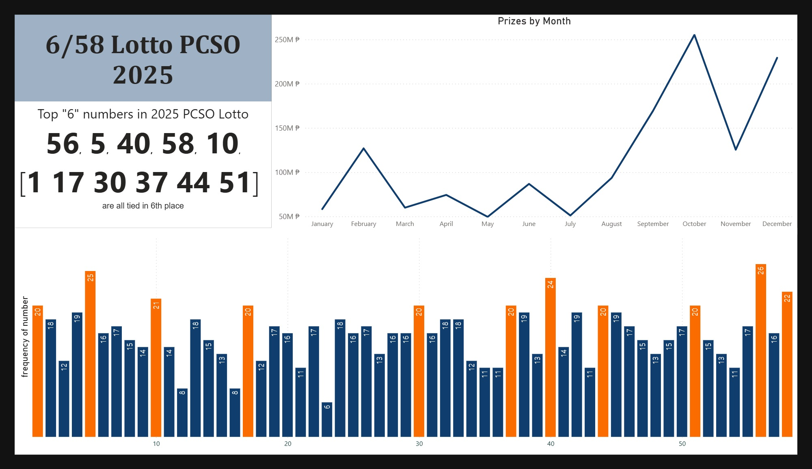

# 6/58 Lotto PCSO 2024

## Project Purpose

Lotteries are games of chance, but analyzing historical data can reveal interesting trends. This project explored the frequency of drawn numbers in the 6/58 PCSO Lotto for 2024, aiming to identify any potential patterns and provide insights for informational purposes. It's important to remember that lottery draws are ultimately random, and past performance does not guarantee future results. This analysis is purely statistical and for entertainment purposes.  **No predictions are made or implied.** Soon? maybe?

## Key Findings:

**Top 6 Most Drawn Numbers**: 
  🔹 56, 5, 40, 58, 10  
  🔹 Numbers 1, 17, 30, 37, 44, and 51 are tied for the 6th spot.

## Process

1.  **Data Acquisition & Preparation:** Energy generation data was scraped from official Lotto wesbite using Excel, then loaded in using Python (Pandas, NumPy).
2.  **Data Exploration & Modeling:**  Data was explored using Python, then modeled within Power BI.
    * [Github Notebook](https://github.com/vlzjc/PowerBI/blob/main/LottoAnalysis/data%20analysis%20lotto.ipynb)
3.  **Dashboard Development:** The dashboard was created in Power BI.

## Analysis & Insights:

The bar chart highlights the frequency of each number drawn, while the line graph represents the prize amounts won each month, with notable peaks in October and December. Although high-frequency numbers may suggest patterns, it is important to remember that lotto draws remain entirely random.

## My Role & Contributions:

*   Collected and cleaned the 6/58 PCSO Lotto data for 2024 from [the official PCSO website](https://www.pcso.gov.ph/searchlottoresult.aspx), ensuring data accuracy and consistency for analysis.
*   "Developed the visualizations (bar chart and line graph) in Power BI to effectively communicate the number frequency and prize amount trends."
*   "Analyzed the data to identify the most frequently drawn numbers and any potential patterns in prize distribution."

## Tools Used:

Python (for data cleaning/analysis if used), Power BI (for visualization)

## Key Learnings:

This project provided valuable experience in working with real-world lottery data and visualizing trends. I learned how to effectively present statistical information in a clear and engaging way using Power BI, emphasizing the importance of responsible interpretation of data. I also learned that following the pi(π) sequence is much easier or 

**Crucial Reminders:**

*   **Disclaimer:** It's *extremely* important to reiterate the randomness of lotto draws and that this analysis is for informational and entertainment purposes only. I do not encourage gambling.
*   **Data Source:** [the official PCSO website](https://www.pcso.gov.ph/searchlottoresult.aspx)
*   **Disclaimer**: The Odds is 1 out of 40,475,358 combinations. 1% of that is 404753.58, If ₱20.00 You'll need about ₱ 8,095,071.00 for 1%