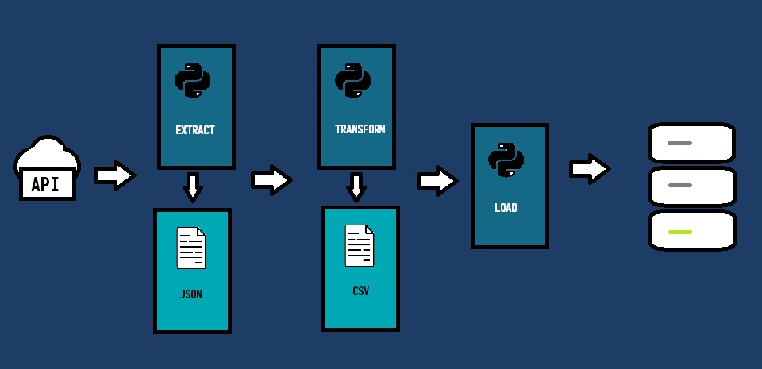

# OPM Database ETL

## Project Purpose
The objective of this project is to utilize an API to collect song data from a music streaming service and efficiently load the retrieved information into a MySQL database. This system is designed to ensure effective storage and retrieval of song data, facilitating streamlined management and access.

## Process
1. API Integration:
* Establish a connection one of Rapid API free API using [Python](https://github.com/vlzjc/OPM-dataset/blob/main/extract.py) 
* Retrieve comprehensive song-related data, including track title, artist, album, release date, and other relevant metadata.
2. Data Collection:
* Utilize the API to fetch songs from a randomly selected playlist, ensuring the collection of all songs within that [playlist](https://github.com/vlzjc/OPM-dataset/blob/main/playlists.txt).
3. Data Preprocessing:
* Convert JSON-formatted files into a suitable CSV format for easier manipulation and storage using [Python](https://github.com/vlzjc/OPM-dataset/blob/main/transform.py)
* Review the raw data retrieved from the API, addressing any missing values and ensuring consistency in formatting for efficient storage within MySQL
4. Future Plans:
* Develop a subsequent project focused on cleaning and optimizing the data stored within the MySQL database to enhance accuracy and performance, while also adding more data to the database for expanded functionality and improved insights.

## **My Role & Contributions:**
* API Integration:
  * Took responsibility for identifying and selecting a suitable free API from RapidAPI that aligns with the project requirements.
  * Established the connection between the application and the API, ensuring seamless data retrieval for all song-related information.

* Data Collection:
  * Managed the process of fetching song data from a randomly selected playlist using the API.
  * Implemented logic to iterate through the playlist, collecting metadata for every song to ensure comprehensive coverage.
## **Tools Used:** 
Python, Excel, MySQL

## **Key Learnings:**
This project allowed me to enhance both my technical skills and problem-solving abilities while giving me a deeper appreciation for the full cycle of data collection, storage, and management. I mean there was a lot of errors

