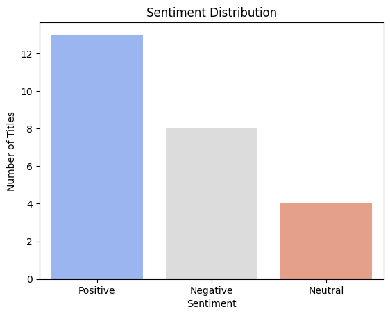

# r/Showerthoughts top of all time sentiment analysis

## Project Purpose

The goal of this sentiment analysis is to understand public perception regarding the subreddit, based on data collected using the Reddit Scrapper API. I analyzed the top posts of all time in the subreddit r/Showerthoughts.

## Methodology

* Data Collection:
Using the Reddit Scrapper API, focusing on the TOP posts of ALL TIME

* Sentiment Analysis Tool:
Sentiment analysis was conducted using VADER, a lexicon-based tool that evaluates text for positive, neutral, and negative sentiment.

## Key Metrics and Visualization
* Visualization 

* Most Positive & Negative Posts
    * ***Most Positive Title*** : College students don't want to go to graduation ceremonies, but they go to please their relatives, while relatives don't want to go but go to support the students; we should all just be honest and skip that ceremony and go out for pizza.

    * ***Most Negative Title*** : We all think of Gordon Ramsay as an extremely picky food critic/chef but if your life's work was cooking and you saw a narcissistic restaurant manager breaking health code violations and making horrible food, you'd be pretty angry too.

## Conclusions & Recommendations

* Summarize Key Findings:
The community's sentiment is predominantly positive, with spikes in negativity tied to specific events.
* Actionable Insights:
None. the TOP of all time is based upon people voting one ↑ upvote ↓ downvote system. the posts here are entirely random by each user.
* Future Considerations:
For deeper insights, sentiment analysis could be extended to include user comments or posts score.

## Process 

The Whole process is also seen on my Github Repo page link down below!

1. [Data Collection](https://github.com/vlzjc/subreddit-sentiment-analysis/blob/main/extract.py)

2. [Transformation and Loading](https://github.com/vlzjc/subreddit-sentiment-analysis/blob/main/transform.py)

3. [Sentiment Scoring](https://github.com/vlzjc/subreddit-sentiment-analysis/blob/main/sentiment_score.py)

4. [Sentiment Analysis Visualization](https://github.com/vlzjc/subreddit-sentiment-analysis/blob/main/analysis.ipynb)
