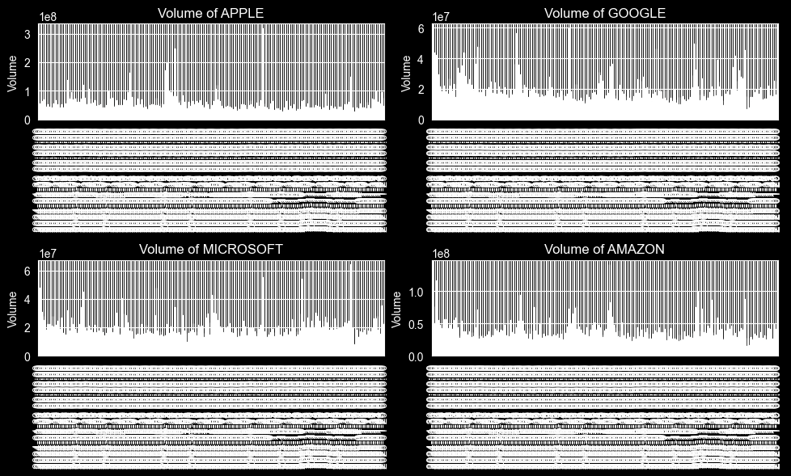

This project is really just me self studying. 


```python
#pandas and NumPy imports
import pandas as pd
from pandas import Series,DataFrame
import numpy as np
```


```python
# For Visualization
import matplotlib.pyplot as plt
import seaborn as sns
sns.set_style('darkgrid')
plt.style.use(['dark_background'])
%matplotlib inline
```


```python
import os #for files read/write
from datetime import datetime # For time stamps
import yfinance as yf #fetching the data stock
from __future__ import division# For division in Python 3
```


```python
# Ignore warnings
import warnings
warnings.filterwarnings("ignore")
```


```python
#Extraction, Transformation and Loading

# Define the list of stock tickers and their corresponding company names
tech_list = ['AAPL', 'GOOG', 'MSFT', 'AMZN']
company_names = ['APPLE', 'GOOGLE', 'MICROSOFT', 'AMAZON']

# Set the date range (last year to today)
end = datetime.now()
start = datetime(end.year - 1, end.month, end.day)

# Loop to download stock data for each ticker and create a DataFrame for each
for stock, company_name in zip(tech_list, company_names):
    stock_data = yf.download(stock, start, end) # Download the stock data
    stock_data['company_name'] = company_name # Add the 'company_name' column
    stock_data.columns = [col[0] if isinstance(col, tuple) else col for col in stock_data.columns] #drops the 2nd level in column names
    globals()[stock] = stock_data
```

    [*********************100%***********************]  1 of 1 completed
    [*********************100%***********************]  1 of 1 completed
    [*********************100%***********************]  1 of 1 completed
    [*********************100%***********************]  1 of 1 completed
    


```python
#Data Preparation and Val
AAPL.info()
GOOG.info()
MSFT.info()
AMZN.info()
```

    <class 'pandas.core.frame.DataFrame'>
    DatetimeIndex: 251 entries, 2024-01-30 to 2025-01-29
    Data columns (total 6 columns):
     #   Column        Non-Null Count  Dtype  
    ---  ------        --------------  -----  
     0   Close         251 non-null    float64
     1   High          251 non-null    float64
     2   Low           251 non-null    float64
     3   Open          251 non-null    float64
     4   Volume        251 non-null    int64  
     5   company_name  251 non-null    object 
    dtypes: float64(4), int64(1), object(1)
    memory usage: 13.7+ KB
    <class 'pandas.core.frame.DataFrame'>
    DatetimeIndex: 251 entries, 2024-01-30 to 2025-01-29
    Data columns (total 6 columns):
     #   Column        Non-Null Count  Dtype  
    ---  ------        --------------  -----  
     0   Close         251 non-null    float64
     1   High          251 non-null    float64
     2   Low           251 non-null    float64
     3   Open          251 non-null    float64
     4   Volume        251 non-null    int64  
     5   company_name  251 non-null    object 
    dtypes: float64(4), int64(1), object(1)
    memory usage: 13.7+ KB
    <class 'pandas.core.frame.DataFrame'>
    DatetimeIndex: 251 entries, 2024-01-30 to 2025-01-29
    Data columns (total 6 columns):
     #   Column        Non-Null Count  Dtype  
    ---  ------        --------------  -----  
     0   Close         251 non-null    float64
     1   High          251 non-null    float64
     2   Low           251 non-null    float64
     3   Open          251 non-null    float64
     4   Volume        251 non-null    int64  
     5   company_name  251 non-null    object 
    dtypes: float64(4), int64(1), object(1)
    memory usage: 13.7+ KB
    <class 'pandas.core.frame.DataFrame'>
    DatetimeIndex: 251 entries, 2024-01-30 to 2025-01-29
    Data columns (total 6 columns):
     #   Column        Non-Null Count  Dtype  
    ---  ------        --------------  -----  
     0   Close         251 non-null    float64
     1   High          251 non-null    float64
     2   Low           251 non-null    float64
     3   Open          251 non-null    float64
     4   Volume        251 non-null    int64  
     5   company_name  251 non-null    object 
    dtypes: float64(4), int64(1), object(1)
    memory usage: 13.7+ KB
    


```python
AAPL.isna().sum()
GOOG.isna().sum()
MSFT.isna().sum()
AMZN.isna().sum()
```


    Close           0
    High            0
    Low             0
    Open            0
    Volume          0
    company_name    0
    dtype: int64


```python
AAPL.tail()
```


<div>
<style scoped>
    .dataframe tbody tr th:only-of-type {
        vertical-align: middle;
    }

    .dataframe tbody tr th {
        vertical-align: top;
    }

    .dataframe thead th {
        text-align: right;
    }
</style>
<table border="1" class="dataframe">
  <thead>
    <tr style="text-align: right;">
      <th></th>
      <th>Close</th>
      <th>High</th>
      <th>Low</th>
      <th>Open</th>
      <th>Volume</th>
      <th>company_name</th>
    </tr>
    <tr>
      <th>Date</th>
      <th></th>
      <th></th>
      <th></th>
      <th></th>
      <th></th>
      <th></th>
    </tr>
  </thead>
  <tbody>
    <tr>
      <th>2025-01-23</th>
      <td>223.660004</td>
      <td>227.029999</td>
      <td>222.300003</td>
      <td>224.740005</td>
      <td>60234800</td>
      <td>APPLE</td>
    </tr>
    <tr>
      <th>2025-01-24</th>
      <td>222.779999</td>
      <td>225.630005</td>
      <td>221.410004</td>
      <td>224.779999</td>
      <td>54697900</td>
      <td>APPLE</td>
    </tr>
    <tr>
      <th>2025-01-27</th>
      <td>229.860001</td>
      <td>232.149994</td>
      <td>223.979996</td>
      <td>224.020004</td>
      <td>94863400</td>
      <td>APPLE</td>
    </tr>
    <tr>
      <th>2025-01-28</th>
      <td>238.259995</td>
      <td>240.190002</td>
      <td>230.809998</td>
      <td>230.850006</td>
      <td>75707600</td>
      <td>APPLE</td>
    </tr>
    <tr>
      <th>2025-01-29</th>
      <td>239.360001</td>
      <td>239.860001</td>
      <td>234.009995</td>
      <td>234.119995</td>
      <td>45375500</td>
      <td>APPLE</td>
    </tr>
  </tbody>
</table>
</div>


```python
df = pd.concat([AAPL, GOOG, MSFT, AMZN]) #combining into 1 data frame
```


```python
df.describe()
```


<div>
<style scoped>
    .dataframe tbody tr th:only-of-type {
        vertical-align: middle;
    }

    .dataframe tbody tr th {
        vertical-align: top;
    }

    .dataframe thead th {
        text-align: right;
    }
</style>
<table border="1" class="dataframe">
  <thead>
    <tr style="text-align: right;">
      <th></th>
      <th>Close</th>
      <th>High</th>
      <th>Low</th>
      <th>Open</th>
      <th>Volume</th>
    </tr>
  </thead>
  <tbody>
    <tr>
      <th>count</th>
      <td>1004.000000</td>
      <td>1004.000000</td>
      <td>1004.000000</td>
      <td>1004.000000</td>
      <td>1.004000e+03</td>
    </tr>
    <tr>
      <th>mean</th>
      <td>247.757034</td>
      <td>249.968354</td>
      <td>245.364691</td>
      <td>247.712597</td>
      <td>3.429337e+07</td>
    </tr>
    <tr>
      <th>std</th>
      <td>103.610854</td>
      <td>104.288072</td>
      <td>102.806677</td>
      <td>103.654166</td>
      <td>2.413850e+07</td>
    </tr>
    <tr>
      <th>min</th>
      <td>132.085388</td>
      <td>133.540187</td>
      <td>131.079029</td>
      <td>132.264771</td>
      <td>6.809800e+06</td>
    </tr>
    <tr>
      <th>25%</th>
      <td>175.433891</td>
      <td>177.498972</td>
      <td>173.789607</td>
      <td>175.406339</td>
      <td>1.783135e+07</td>
    </tr>
    <tr>
      <th>50%</th>
      <td>193.935982</td>
      <td>196.662498</td>
      <td>192.459999</td>
      <td>194.357506</td>
      <td>2.850340e+07</td>
    </tr>
    <tr>
      <th>75%</th>
      <td>291.053703</td>
      <td>294.488971</td>
      <td>289.251850</td>
      <td>290.565951</td>
      <td>4.324608e+07</td>
    </tr>
    <tr>
      <th>max</th>
      <td>465.786438</td>
      <td>466.573450</td>
      <td>462.698189</td>
      <td>465.228569</td>
      <td>3.186799e+08</td>
    </tr>
  </tbody>
</table>
</div>


```python
df.info()
```

    <class 'pandas.core.frame.DataFrame'>
    DatetimeIndex: 1004 entries, 2024-01-30 to 2025-01-29
    Data columns (total 6 columns):
     #   Column        Non-Null Count  Dtype  
    ---  ------        --------------  -----  
     0   Close         1004 non-null   float64
     1   High          1004 non-null   float64
     2   Low           1004 non-null   float64
     3   Open          1004 non-null   float64
     4   Volume        1004 non-null   int64  
     5   company_name  1004 non-null   object 
    dtypes: float64(4), int64(1), object(1)
    memory usage: 54.9+ KB
    


```python
# Let's see a historical view of the closing price
plt.figure(figsize=(15, 10))
plt.subplots_adjust(top=1.25, bottom=1.2)

# Assuming company_names contains 4 company names
for i, company in enumerate(company_names, 1):
    plt.subplot(2, 2, i)  # 2x2 grid for 4 companies
    df[df['company_name'] == company]['Close'].plot()  # Filter data for each company
    plt.ylabel('Close')
    plt.xlabel(None)
    plt.title(f"Closing Price of {company}")

plt.tight_layout()  # Adjust layout to prevent overlap
plt.show()
```


    

    


```python
df = df.reset_index()
```


```python
from mpl_toolkits.mplot3d import Axes3D

# Create figure
fig = plt.figure(figsize=(15, 10))
ax = fig.add_subplot(111, projection='3d')

# Define bar width
bar_width = 0.6  

# Unique companies
companies = df['company_name'].unique()

# Loop through each company to plot bars
for i, company in enumerate(companies):
    # Filter data for the current company
    company_data = df[df['company_name'] == company]

    # X-axis: Convert dates into numeric values
    dates = np.arange(len(company_data))

    # Y-axis: Company index (shifted to prevent overlap)
    y = np.full_like(dates, i)  

    # Z-axis: Volume data
    volume = company_data['Volume']

    # Plot 3D bar graph
    ax.bar3d(dates, y, np.zeros_like(volume), dx=bar_width, dy=bar_width, dz=volume, color=np.random.rand(3,))

# Labels and title
ax.set_xlabel("Date")
ax.set_ylabel("Company")
ax.set_zlabel("Volume")
ax.set_title("3D Bar Chart of Trading Volume")

# Set Y-axis labels to company names
ax.set_yticks(np.arange(len(companies)))
ax.set_yticklabels(companies)

plt.show()
```


    

    


```python
plt.figure(figsize=(15, 10))
plt.subplots_adjust(top=1.25, bottom=1.2)

for i, company in enumerate(company_names, 1):
    plt.subplot(2, 2, i)  # 2x2 grid for 4 companies
    df[df['company_name'] == company]['Volume'].plot(kind='bar', figsize=(10, 6))  # Plot volume as bars
    plt.ylabel('Volume')
    plt.xlabel(None)
    plt.title(f"Volume of {company}")

plt.tight_layout()  # Adjust layout to prevent overlap
plt.show()

```


    

    


```python
plt.figure(figsize=(15, 10))
plt.subplots_adjust(top=1.25, bottom=1.2)

# Loop over each company
for i, company in enumerate(company_names, 1):
    plt.subplot(2, 2, i)  # 2x2 grid for 4 companies
    
    # Filter the data for the current company
    company_data = df[df['company_name'] == company]
    
    # Calculate the moving averages for the company
    company_data['MA_10'] = company_data['Close'].rolling(window=10).mean()
    company_data['MA_20'] = company_data['Close'].rolling(window=20).mean()
    company_data['MA_50'] = company_data['Close'].rolling(window=50).mean()
    
    # Plot the closing price and the moving averages
    company_data['Close'].plot(label='Close', color='blue')
    company_data['MA_10'].plot(label='10-Day MA', color='green')
    company_data['MA_20'].plot(label='20-Day MA', color='orange')
    company_data['MA_50'].plot(label='50-Day MA', color='red')
    
    # Set plot title and labels
    plt.title(f"Moving Averages of {company}")
    plt.xlabel(None)
    plt.ylabel('Price')
    plt.legend()

plt.tight_layout()  # Adjust layout to prevent overlap
plt.show()

```


    

    


```python
plt.figure(figsize=(15, 10))
plt.subplots_adjust(top=1.25, bottom=1.2)

# Loop over each company to create subplots
for i, company in enumerate(company_names, 1):
    plt.subplot(2, 2, i)  # 2x2 grid for 4 companies
    
    # Filter data for the current company
    company_data = df[df['company_name'] == company].copy()
    
    # Ensure 'Date' is used correctly (whether it's an index or column)
    if 'Date' not in company_data.columns:
        company_data = company_data.reset_index()  # Reset index if 'Date' is in index
    
    # Calculate Daily Returns (DR)
    company_data['Daily_Return'] = (((company_data['Close'] - company_data['Open']) / company_data['Open'])*100)
    
    # Plot Daily Returns as a bar chart
    company_data.plot(x='Date', y='Daily_Return', kind='bar', ax=plt.gca(), color='blue', alpha=0.7)

    # Title and labels
    plt.title(f"Daily Returns of {company}")
    plt.xlabel("Date")
    plt.ylabel("Daily Return")
    plt.xticks([])  # Hide x-axis labels for readability

plt.tight_layout()  # Adjust layout to prevent overlap
plt.show()
```


    

    


```python
# Create a new dataframe with only the 'Close column 
data = df.filter(['Close'])
# Convert the dataframe to a numpy array
dataset = data.values
# Get the number of rows to train the model on
training_data_len = int(np.ceil( len(dataset) * .95 ))

training_data_len
```


    954


```python
# Scale the data
from sklearn.preprocessing import MinMaxScaler

scaler = MinMaxScaler(feature_range=(0,1))
scaled_data = scaler.fit_transform(dataset)

scaled_data
```


    array([[0.16493167],
           [0.15407693],
           [0.16141293],
           ...,
           [0.30966223],
           [0.31784319],
           [0.3146068 ]])


```python
# Create the training data set 
# Create the scaled training data set
train_data = scaled_data[0:int(training_data_len), :]
# Split the data into x_train and y_train data sets
x_train = []
y_train = []

for i in range(60, len(train_data)):
    x_train.append(train_data[i-60:i, 0])
    y_train.append(train_data[i, 0])
    if i<= 61:
        print(x_train)
        print(y_train)
        print()
        
# Convert the x_train and y_train to numpy arrays 
x_train, y_train = np.array(x_train), np.array(y_train)

# Reshape the data
x_train = np.reshape(x_train, (x_train.shape[0], x_train.shape[1], 1))
# x_train.shape
```

    [array([0.16493167, 0.15407693, 0.16141293, 0.15840096, 0.16385817,
           0.1686892 , 0.16901724, 0.16576677, 0.16806586, 0.16298983,
           0.15668957, 0.15403212, 0.15316626, 0.14853806, 0.14629868,
           0.14856801, 0.15468897, 0.14916519, 0.14510436, 0.14949359,
           0.14588065, 0.1438801 , 0.14062551, 0.12700984, 0.11214009,
           0.10915423, 0.10879592, 0.11396149, 0.11999301, 0.1214262 ,
           0.11515589, 0.12073949, 0.11960484, 0.12288929, 0.12993607,
           0.13766946, 0.11587242, 0.11858959, 0.11431984, 0.11091591,
           0.12166507, 0.11620087, 0.1118714 , 0.10831813, 0.11073676,
           0.1082585 , 0.11052774, 0.10715367, 0.11079643, 0.10515307,
           0.12683068, 0.1313394 , 0.11981381, 0.10993056, 0.10581002,
           0.10294351, 0.09685236, 0.09936047, 0.10252548, 0.10885564])]
    [0.11145337473785322]
    
    [array([0.16493167, 0.15407693, 0.16141293, 0.15840096, 0.16385817,
           0.1686892 , 0.16901724, 0.16576677, 0.16806586, 0.16298983,
           0.15668957, 0.15403212, 0.15316626, 0.14853806, 0.14629868,
           0.14856801, 0.15468897, 0.14916519, 0.14510436, 0.14949359,
           0.14588065, 0.1438801 , 0.14062551, 0.12700984, 0.11214009,
           0.10915423, 0.10879592, 0.11396149, 0.11999301, 0.1214262 ,
           0.11515589, 0.12073949, 0.11960484, 0.12288929, 0.12993607,
           0.13766946, 0.11587242, 0.11858959, 0.11431984, 0.11091591,
           0.12166507, 0.11620087, 0.1118714 , 0.10831813, 0.11073676,
           0.1082585 , 0.11052774, 0.10715367, 0.11079643, 0.10515307,
           0.12683068, 0.1313394 , 0.11981381, 0.10993056, 0.10581002,
           0.10294351, 0.09685236, 0.09936047, 0.10252548, 0.10885564]), array([0.15407693, 0.16141293, 0.15840096, 0.16385817, 0.1686892 ,
           0.16901724, 0.16576677, 0.16806586, 0.16298983, 0.15668957,
           0.15403212, 0.15316626, 0.14853806, 0.14629868, 0.14856801,
           0.15468897, 0.14916519, 0.14510436, 0.14949359, 0.14588065,
           0.1438801 , 0.14062551, 0.12700984, 0.11214009, 0.10915423,
           0.10879592, 0.11396149, 0.11999301, 0.1214262 , 0.11515589,
           0.12073949, 0.11960484, 0.12288929, 0.12993607, 0.13766946,
           0.11587242, 0.11858959, 0.11431984, 0.11091591, 0.12166507,
           0.11620087, 0.1118714 , 0.10831813, 0.11073676, 0.1082585 ,
           0.11052774, 0.10715367, 0.11079643, 0.10515307, 0.12683068,
           0.1313394 , 0.11981381, 0.10993056, 0.10581002, 0.10294351,
           0.09685236, 0.09936047, 0.10252548, 0.10885564, 0.11145337])]
    [0.11145337473785322, 0.10969169203845808]
    
    


```python
#uncomment if you don't have this package installed
#!pip install tensorflow
```


```python
from keras.models import Sequential
from keras.layers import Dense, LSTM

# Build the LSTM model
model = Sequential()
model.add(LSTM(128, return_sequences=True, input_shape= (x_train.shape[1], 1)))
model.add(LSTM(64, return_sequences=False))
model.add(Dense(25))
model.add(Dense(1))

# Compile the model
model.compile(optimizer='adam', loss='mean_squared_error')

# Train the model
model.fit(x_train, y_train, batch_size=1, epochs=1)
```

    894/894 ━━━━━━━━━━━━━━━━━━━━ 15s 14ms/step - loss: 0.0134
    


    <keras.src.callbacks.history.History at 0x1d877cd1e80>


```python
# Create the testing data set
# Create a new array containing scaled values from index 1543 to 2002 
test_data = scaled_data[training_data_len - 60: , :]
# Create the data sets x_test and y_test
x_test = []
y_test = dataset[training_data_len:, :]
for i in range(60, len(test_data)):
    x_test.append(test_data[i-60:i, 0])
    
# Convert the data to a numpy array
x_test = np.array(x_test)

# Reshape the data
x_test = np.reshape(x_test, (x_test.shape[0], x_test.shape[1], 1 ))

# Get the models predicted price values 
predictions = model.predict(x_test)
predictions = scaler.inverse_transform(predictions)

# Get the root mean squared error (RMSE)
rmse = np.sqrt(np.mean(((predictions - y_test) ** 2)))
rmse
```

    2/2 ━━━━━━━━━━━━━━━━━━━━ 1s 291ms/step
    


    11.663027565062306


```python
# Plot the data
train = data[:training_data_len]
valid = data[training_data_len:]
valid['Predictions'] = predictions
# Visualize the data
plt.figure(figsize=(16,6))
plt.title('Model')
plt.xlabel('Date', fontsize=18)
plt.ylabel('Close Price USD ($)', fontsize=18)
plt.plot(train['Close'])
plt.plot(valid[['Close', 'Predictions']])
plt.legend(['Train', 'Val', 'Predictions'], loc='lower right')
plt.show()
```


    

    


```python
# Create a figure
plt.figure(figsize=(16, 6))

# Set title and labels
plt.title('Zoomed-In View of Change Point')
plt.xlabel('Date')
plt.ylabel('Close Price USD ($)')

# Focus only on the last few points of training and the first few of validation
zoom_range = valid.index[:20]  # Adjust range to show only the transition area
plt.plot(train['Close'].iloc[-20:], label='Train (Recent)', color='blue')  # Last 20 train points
plt.plot(valid['Close'][:20], label='Validation (Start)', color='green')  # First 20 validation points
plt.plot(valid['Predictions'][:20], label='Predictions (Start)', linestyle='dashed', color='red')  # Predictions

# Add a vertical line at the transition point
plt.axvline(x=train.index[-1], color='black', linestyle='--', linewidth=2, label='Change Point')

# Show legend
plt.legend(loc='lower right')

# Show the plot
plt.show()
```


    

    


```python
# Show the valid and predicted prices
valid
```


<div>
<style scoped>
    .dataframe tbody tr th:only-of-type {
        vertical-align: middle;
    }

    .dataframe tbody tr th {
        vertical-align: top;
    }

    .dataframe thead th {
        text-align: right;
    }
</style>
<table border="1" class="dataframe">
  <thead>
    <tr style="text-align: right;">
      <th></th>
      <th>Close</th>
      <th>Predictions</th>
    </tr>
  </thead>
  <tbody>
    <tr>
      <th>954</th>
      <td>211.479996</td>
      <td>200.962662</td>
    </tr>
    <tr>
      <th>955</th>
      <td>202.610001</td>
      <td>201.917984</td>
    </tr>
    <tr>
      <th>956</th>
      <td>201.699997</td>
      <td>200.693253</td>
    </tr>
    <tr>
      <th>957</th>
      <td>204.610001</td>
      <td>198.530945</td>
    </tr>
    <tr>
      <th>958</th>
      <td>202.880005</td>
      <td>196.930450</td>
    </tr>
    <tr>
      <th>959</th>
      <td>198.380005</td>
      <td>195.598526</td>
    </tr>
    <tr>
      <th>960</th>
      <td>197.119995</td>
      <td>193.828171</td>
    </tr>
    <tr>
      <th>961</th>
      <td>201.449997</td>
      <td>192.002090</td>
    </tr>
    <tr>
      <th>962</th>
      <td>207.860001</td>
      <td>191.377090</td>
    </tr>
    <tr>
      <th>963</th>
      <td>205.740005</td>
      <td>192.699310</td>
    </tr>
    <tr>
      <th>964</th>
      <td>207.889999</td>
      <td>194.289505</td>
    </tr>
    <tr>
      <th>965</th>
      <td>210.710007</td>
      <td>196.120667</td>
    </tr>
    <tr>
      <th>966</th>
      <td>213.440002</td>
      <td>198.242477</td>
    </tr>
    <tr>
      <th>967</th>
      <td>218.160004</td>
      <td>200.591705</td>
    </tr>
    <tr>
      <th>968</th>
      <td>220.550003</td>
      <td>203.469986</td>
    </tr>
    <tr>
      <th>969</th>
      <td>227.029999</td>
      <td>206.454132</td>
    </tr>
    <tr>
      <th>970</th>
      <td>226.089996</td>
      <td>210.116470</td>
    </tr>
    <tr>
      <th>971</th>
      <td>225.039993</td>
      <td>213.137314</td>
    </tr>
    <tr>
      <th>972</th>
      <td>230.259995</td>
      <td>215.015259</td>
    </tr>
    <tr>
      <th>973</th>
      <td>228.970001</td>
      <td>216.967575</td>
    </tr>
    <tr>
      <th>974</th>
      <td>227.460007</td>
      <td>218.273041</td>
    </tr>
    <tr>
      <th>975</th>
      <td>232.929993</td>
      <td>218.704636</td>
    </tr>
    <tr>
      <th>976</th>
      <td>231.149994</td>
      <td>219.701584</td>
    </tr>
    <tr>
      <th>977</th>
      <td>220.520004</td>
      <td>220.400848</td>
    </tr>
    <tr>
      <th>978</th>
      <td>223.289993</td>
      <td>218.760635</td>
    </tr>
    <tr>
      <th>979</th>
      <td>224.919998</td>
      <td>216.936539</td>
    </tr>
    <tr>
      <th>980</th>
      <td>225.059998</td>
      <td>215.721542</td>
    </tr>
    <tr>
      <th>981</th>
      <td>229.050003</td>
      <td>215.087769</td>
    </tr>
    <tr>
      <th>982</th>
      <td>227.050003</td>
      <td>215.662537</td>
    </tr>
    <tr>
      <th>983</th>
      <td>223.750000</td>
      <td>216.321228</td>
    </tr>
    <tr>
      <th>984</th>
      <td>221.300003</td>
      <td>216.274902</td>
    </tr>
    <tr>
      <th>985</th>
      <td>219.389999</td>
      <td>215.456314</td>
    </tr>
    <tr>
      <th>986</th>
      <td>220.220001</td>
      <td>214.087143</td>
    </tr>
    <tr>
      <th>987</th>
      <td>224.190002</td>
      <td>212.910767</td>
    </tr>
    <tr>
      <th>988</th>
      <td>227.610001</td>
      <td>212.840790</td>
    </tr>
    <tr>
      <th>989</th>
      <td>222.110001</td>
      <td>213.972137</td>
    </tr>
    <tr>
      <th>990</th>
      <td>222.130005</td>
      <td>214.373245</td>
    </tr>
    <tr>
      <th>991</th>
      <td>218.940002</td>
      <td>214.371307</td>
    </tr>
    <tr>
      <th>992</th>
      <td>218.460007</td>
      <td>213.558441</td>
    </tr>
    <tr>
      <th>993</th>
      <td>217.759995</td>
      <td>212.438889</td>
    </tr>
    <tr>
      <th>994</th>
      <td>223.350006</td>
      <td>211.263016</td>
    </tr>
    <tr>
      <th>995</th>
      <td>220.660004</td>
      <td>211.383118</td>
    </tr>
    <tr>
      <th>996</th>
      <td>225.940002</td>
      <td>211.557419</td>
    </tr>
    <tr>
      <th>997</th>
      <td>230.710007</td>
      <td>212.757065</td>
    </tr>
    <tr>
      <th>998</th>
      <td>235.009995</td>
      <td>215.113373</td>
    </tr>
    <tr>
      <th>999</th>
      <td>235.419998</td>
      <td>218.361267</td>
    </tr>
    <tr>
      <th>1000</th>
      <td>234.850006</td>
      <td>221.429352</td>
    </tr>
    <tr>
      <th>1001</th>
      <td>235.419998</td>
      <td>223.658310</td>
    </tr>
    <tr>
      <th>1002</th>
      <td>238.149994</td>
      <td>225.127777</td>
    </tr>
    <tr>
      <th>1003</th>
      <td>237.070007</td>
      <td>226.447754</td>
    </tr>
  </tbody>
</table>
</div>


```python

```
